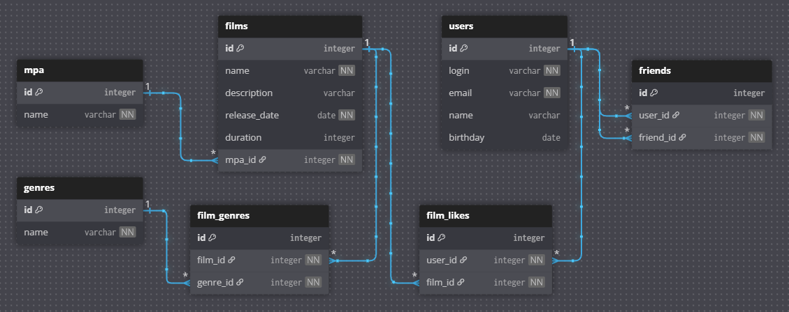

# java-filmorate
Template repository for Filmorate project.

## ER-диаграмма

### База данных хранит таблицы: 
- с фильмами (films) и пользователями (users);
- с пользователями, добавившими других пользователей в друзья (friends);
- с жанрами добавленных фильмов (film_genres) и пользователями, которым они понравились (film_likes);
- с перечислениями всех жанров (genres) и возрастных рейтингов (mpa) фильмов.  

#### Пример запроса на получение ТОП-3 самых популярных у пользователей фильмов:
```sql
SELECT f.name,
       EXTRACT(YEAR FROM f.release_date) AS release_year,
       f.duration,
       m.name AS rating
FROM films f
LEFT OUTER JOIN film_likes fl ON f.id = fl.film_id
LEFT OUTER JOIN mpa m ON f.mpa_id = m.id 
GROUP BY f.id, m.name
ORDER BY COUNT(f.id) DESC
LIMIT 3;
```
#### Пример итоговой таблицы
