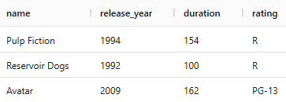

# java-filmorate
Template repository for Filmorate project.

## ER-диаграмма

### База данных хранит таблицы: 
- с фильмами (film) и пользователями (user);
- с пользователями, добавившими других пользователей в друзья (friends);
- с жанрами фильмов (film_genre) и пользователями, которым они понравились (film_likes);
- таблицы-перечисления жанров (genre) и рейтингов (rating).  

#### Пример запроса для получения списка понравившихся пользователю с id = 1 фильмов в лексикографическом порядке:
```sql
SELECT f.name AS film_name,
       r.name AS rating,
       EXTRACT(YEAR FROM f.release_date) AS release_year
FROM film AS f
LEFT OUTER JOIN film_rating AS fr ON f.id = fr.film_id
LEFT OUTER JOIN rating AS r ON fr.rating_id = r.id
WHERE f.id IN (
  SELECT fl.film_id
  FROM film_likes AS fl
  WHERE fl.user_id = 1
)
ORDER BY f.name;
```
#### Пример итоговой таблицы
